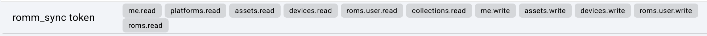

# romm_sync

A utility for syncing emulator save files across your gaming devices and backing them up to [RomM](https://romm.app/).

# Overview

I've found that Romm is a nice way to have a "source of truth" for my game library, but for now, full-featured clients like [Grout](https://github.com/rommapp/grout) are not supported for all handhelds and Romm's planned sync feature is not ready (yet). If you have multiple handhelds whose saves are kept in sync with syncthing and want a way to have those in RomM so you can switch back and forth at will, **romm_sync** might help! 

This all started when I set up Syncthing between my devices with Retroarch-based OS's (Android, MuOS, Knulli,...) and Minarch-based OS's (MinUI, NextUI) and none of the folders lined up properly and forced me into making a tedious Syncthing folder setup. Doable yes, but annoying. I had my Romm instance sitting right there and an opportunity to practice my Python for work so now...here we are.

## What you'll need:
- A server or NAS of some kind that hosts a central file sync location. I use Syncthing, but technically it could be anything.
- A self hosted instance of Romm that is accessible by the machine on which this app is deployed.
- Docker to deploy the app.

## What this does:
1. Gaming devices sync save files to a central location via Syncthing.
2. `romm_sync` detects new/modified saves and states in this "local library"
3. Matches the contents of your library with the content on your Romm instance.

## Some caveats

### Limited Scope of Save Support
I wrote this mainly for my uses, so it's probably not taking everybody possible folder structure into account. My Retroarch instance is configured similar to the Knulli defaults, so it should cover common usage patterns.

- Sort Saves by Content Directory
- Sort States by Content Directory

### Possible incompatibilities
It *does not* sort states by core, though I had some leftover different cores for Nintendo DS that seemed to work ok. This will work best with save (.srm) files, and, if you're consistent in the cores you use, .state files should "just work" as well.

The implicit assumption here is that the game files (ROM, with one M) on your device are *already* the same files as the ROM's in your Romm library. Set up your Romm library before trying to run this app. A tip that really helped me is that Romm allows you to map your *local* directory names to *their supported platform names* ("slugs") to make library management easier. [See the docs here.](https://docs.romm.app/latest/Getting-Started/Configuration-File/?h=platform+name#custom-folder-names) 

### This is NOT a Romm Client. 

It's just a one way push to Romm from Syncthing with the expectation that you use a real RomM client to pull from Romm to your handheld. (see Grout, for example). This just makes it easier to have access to Romm's library organization niceties if you have some devices that don't support a Romm client.

# Architecture

```
Gaming Devices (RetroArch, etc.)
         ↓ (Syncthing)
    Central Sync Folder
         ↓ (romm_sync watches)
    RomM Database (via API)
    + (Optional and Separate) Backup Location
```

# Usage
I tried to make this as hands-off of a setup as possible. The only files you will need are `docker-compose.yml` and `.env.example`. The included compose file is set up to pull the latest image.

I didn't account for every possible use case; generally, this will work best if you have saves and states synced and sorted by platform with a single RomM user. The app mounts all your data read-only, so it should be safe to experiment with something like multiple instances if you'd like to sync save data for multiple RomM users at once. 

## Get the Files
Download `docker-compose.yml`, `.env.example`, and `platform_mapping.yaml` (if desired) to the directory of your choice. Typically, you would rename `.env.example` to `.env` and update the corresponding line in `docker-compose.yml` accordingly (`env_file: .env`), but they will work fine together as written. 

The included docker compose is just the minimum configuration required for the app to run.

## Configure
`docker-compose.yml` is written such that you should not need to edit it at all. Instead, all variables are configured in `.env`. Edit the following variables according to your RoMm and server configuration:

### RomM Configuration

**`ROMM_URL`:** (required)
Your RomM instance's address. 

**`ROMM_AUTH_TYPE`:** (required)
Authentication type for RomM. Options are "http" or "api". 

"api" is the default and is recommended so that publically hosted RomM instances can be locked behind OIDC only.

**`ROMM_API_TOKEN`**: (recommend; required for api auth)

Your API token for RomM. This is required when `ROMM_AUTH_TYPE`=api. You can find this token by clicking on your profile image in the bottom left corner of the RomM UI --> "Client API Tokens" --> Create. Even though `romm_syncthing_sync` doesn't actually have any code that can delete your library, I recommend limiting the permissions just to be safe. These are the permissions I use. They don't allow writing to the actual rom library, collections, or users. 

   

**`ROMM_USERNAME`**: (required for http auth)
Your username in RomM.

**`ROMM_PASSWORD`**: (required for http auth)
Your password for RomM.

**`ROMM_API_LIMIT`**: (optional)
Pagination limit for pulling the full list of ROM's down from RomM. Default follows RomM's default (50 items / request). If you have a very large library, you could try increasing this to speed up initial library build, but you may run into API issues. Changing this is generally not needed; most of the library build is spent getting each save and state catalogued.


### Sync Configuration
This app allows you to use one of two different sync modes:

#### Single Sync Folder
This is similar to Knulli's default. All saves and states are sorted by content directory but placed in the same parent folder, organized like:
```
{SYNC_FOLDER}/
├── Nintendo 64/
│   ├── Game Name.srm
│   ├── Game Name.state
│   └── Game Name.state.png
└── Game Boy Advance/
    ├── Another Game.srm
    └── Another Game.state
```
For this type of sync, use ONLY:

**ALL_SYNC_FOLDER**: the directory on your machine

#### Separate Save and State Parents
This is the way I do it because CFW's like MuOS and MinUI/NextUI put their saves and states in completely different places, but still sort by content directory. On android, you would set your save and state save locations to be different but retain the "Sort by Content Directory" (ONLY!) setting.
```
{SAVE_SYNC_FOLDER}/
├── Nintendo 64/
│   ├── Game Name.srm
└── Game Boy Advance/
    ├── Another Game.srm
{STATE_SYNC_FOLDER}/
├── Nintendo 64/
│   ├── Game Name.state
│   └── Game Name.state.png
└── Game Boy Advance/
    └── Another Game.state
```
For this, use:

**SAVE_SYNC_FOLDER**: local directory with save files (.srm)

**STATE_SYNC_FOLDER**: local directory with state files (.state etc.)

Either `ALL_SYNC_FOLDER` or BOTH `SAVE_SYNC_FOLDER` and `STATE_SYNC_FOLDER` are required.


### `SYNC_MODE` (required) 
Two options here:
- "watch" (default): Runs a full sync when starting the container, then incremental afterward based on changes to files in the sync folders.
- "periodic": runs the full sync between your local library and RomM library every `SYNC_INTERVAL_SECONDS`. 
   - Simpler but if you have a large library, syncs may take a while because it queries the RomM API for every single save and state you have.
   - I have about 40 different games synced with 1 save and a couple states each, running on the same machine as the instance, and a full sync with no changes takes ~20 seconds.

The default is the incremental sync. I generally recommend using the incremental sync.

#### OPTIONALS
- `WATCHDOG_DELAY_SECONDS` (`watch` mode only)
    - the amount of time to wait for a period of no file system activity once a change is detected.
    - DEFAULT: 60s. This means if you save a state at t=0s, syncthing grabs it and puts it on the server at t=5s, and then you save a state again at t=45s (which syncthing again pushes 5s later), the server will not attempt to sync until t=110s.
- `SYNC_INTERVAL_SECONDS` (`periodic` mode only)
    - sync interval for the full sync. A full sync can take a while, especially for larger libraries. Default = 1800s (30 minutes).
- `FULL_INITIAL_SYNC` (both)
    - Exposed in v1.1.0 and changed to default `True`. This enables a full initial sync to RomM on app startup. Previously, the incremental sync would only push files when it saw changes, which could lead to unexpectedly missing files.
    - Options: `True`, `False`, `Force`. Force is the same behavior as `FORCE_PUSH_SYNC`, but only does it on app startup.
- `FORCE_PUSH_SYNC` (both)
    - Push all changed save files and states to RomM regardless if RomM's state is newer. This is a little dangerous. Defaults to `False`.

#### Platform Mapping
A .yaml file is included that you can edit to map your platform directories (i.e snes, nds,...) to the platform "slug" that RomM expects. The app forces a match by game platform, similar to how RomM's uploads work, so this mapping file is required if the platform folder names in your library are different from RomM's. By default, this list attempts to cover for some common systems and alternative slugs used in MinUI/NextUI and Knulli, but it is NOT exhaustive so keep an eye on the logs if you're not seeing some games show up. 

See https://docs.romm.app/latest/Platforms-and-Players/Supported-Platforms/ for RomM's supported platforms.

The mapping is not required, but if it isn't provided, the app can only match *exactly* to RomM's slug.

## Spin it up!
Run the following from a terminal.
```bash
cd {YOUR_DIRECTORY_OF_CHOICE}
docker compose up -d
```

That oughta be it...now it should just work™ and you should soon see all your saves and states in RomM!

# Known Issues
~~- Retroarch's state screenshots are not linked to the corresponding state file on the RomM server. I [submitted a ticket for this](https://github.com/rommapp/romm/issues/3031#issuecomment-3936828273) and it should be addressed in the next RomM release >4.6.1.~~ This has been addressed!

~~- Only supports HTTP Basic Authentication with RomM; no OAuth/OIDC. You may still use OIDC with RomM (I do), but I don't think you can disable HTTP authentication in the RomM configuration.~~ Addressed in version `1.4.0`. You can now either use "http" or "api" auth types. See `.env.example`.

- Right now, Syncthing only PUSHES to RomM. When I have some more free time, I plan to figure out how to implement sync in the other direction.

